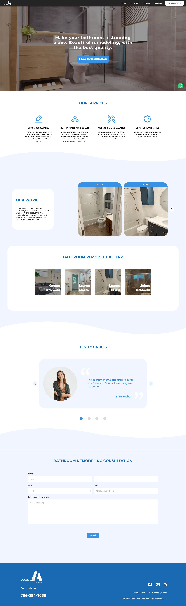
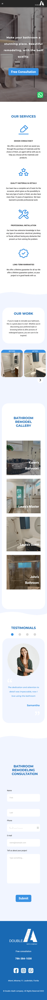

# Responsive website built with React Js

## A fully functional website developed for Double A Bath Company

You can check out the finished project by clicking [this link](https://double-a-bath-company.vercel.app/).

---
### About the project

Website built for Double A Bath Company, a bath remodeling enterprise active in the Miami / Miramar / Fort Lauderdale area in Florida, USA.

Based on the design, specifications and requirements provided by the client we developed the Frontend of their website which allows them to present themselves to potential clients, showcase their work and offer a free consultation.

We used the following technologies, tools and dependencies:

> HTML, CSS, JavaScript, React Js, Git, Bootstrap and Sass.

> Gh-pages, react-bootstrap, react-router-hash-link, sass, styled-components, sweetalert2, uuidv4

---
### Watch the website in action!

https://user-images.githubusercontent.com/79377689/228006570-8225792e-a93b-4c36-be08-7a01809c8d56.mp4

---
#### Contributors:

- Darío Rodriguez - [Github profile](https://github.com/Dario296)

- Estanislao Elías Varela Lucius - [Github profile](https://github.com/EstanisEVL)

---
#### Screenshots:

- Desktop version:

- Mobile version:

